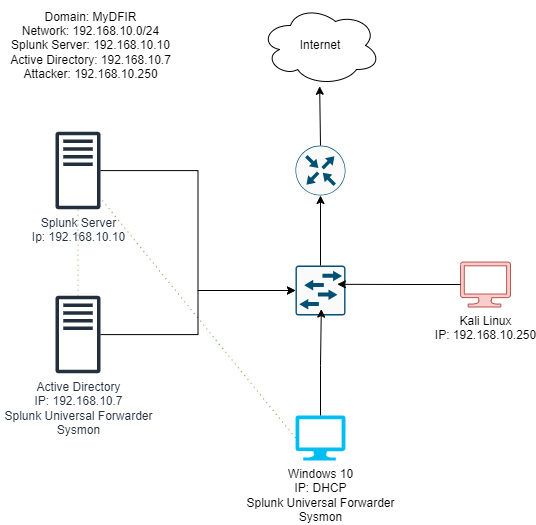

# Hands-On-Active-Directory-Deployment-and-Security-Monitoring-Lab

## Objective
This project involves creating a home lab to learn Active Directory and IT security, encompassing installations, configurations, and security monitoring.

### Skills Learned
- Installation and configuration of Windows Server and Active Directory
- Setting up Splunk for security monitoring
- Conducting and analyzing brute-force attacks
- Understanding of network diagramming and system interconnectivity
- Troubleshooting common Active Directory errors

### Tools Used
- VirtualBox
- Windows Server 2022
- Windows 10
- Kali Linux
- Splunk
- Sysmon
- Atomic Red Team

## Steps
### 1. Building the Network Diagram
I created a detailed network diagram using draw.io, visualizing the connections between various components such as servers, computers, switches, and routers. This diagram serves as a reference for understanding data flow and enhances my ability to discuss technical setups during interviews. Important details, including IP addresses and domain names, were documented for clarity in the lab setup.

*Ref 1: Network Diagram Creation*

### 2. Installing Virtual Machines
In this step, I installed essential virtual machines within VirtualBox, including Windows 10, Kali Linux, Windows Server 2022, and Ubuntu Server. I followed specific instructions for each operating system, ensuring that all necessary dependencies were met. The use of snapshots allowed me to experiment without the risk of permanent mistakes.

*Ref 2: Virtual Machine Installation Process*

### 3. Configuring Sysmon and Splunk
I installed and configured Sysmon for logging system activity and set up Splunk as the Security Information and Event Management (SIEM) tool. This involved creating an 'endpoint' index in Splunk, managing data reception, and verifying that incoming events were logged correctly. This configuration is crucial for effective security monitoring and telemetry analysis.

*Ref 3: Sysmon and Splunk Setup*

### 4. Configuring Active Directory
In this phase, I installed Active Directory on Windows Server, promoted it to a domain controller, and created organizational units and users. I set a static IP address, verified connectivity, and successfully joined target machines to the new domain. This hands-on experience significantly enhanced my understanding of domain management and security considerations.

*Ref 4: Active Directory Configuration Steps*

### 5. Configuring Active Directory
I conducted a brute force attack using Kali Linux, targeting the Remote Desktop Protocol (RDP) on a Windows machine. This step included setting up Kali, installing the crowbar tool, and utilizing a wordlist for password attempts. I analyzed the generated telemetry with Splunk to gain insights into the attack process, improving my understanding of attacker behaviors and detection capabilities.

*Ref 5: Brute Force Attack Execution*

### 6. Troubleshooting
Finally, I focused on troubleshooting common errors encountered throughout the project. This included verifying DNS settings, ensuring proper network communication with Splunk, and managing DHCP addresses. I documented solutions to these issues, fostering a collaborative approach to problem-solving.

*Ref 6: Common Troubleshooting Steps*

