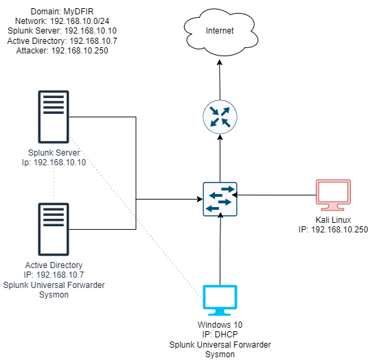

# Hands-On-Active-Directory-Deployment-and-Security-Monitoring-Lab

## Objective
This project involves creating a home lab to learn Active Directory and IT security, encompassing installations, configurations, and security monitoring.

### Skills Learned
- Installation and configuration of Windows Server and Active Directory
- Setting up Splunk for security monitoring
- Conducting and analyzing brute-force attacks
- Understanding of network diagramming and system interconnectivity
- Troubleshooting common Active Directory errors

### Tools Used
- VirtualBox
- Windows Server 2022
- Windows 10
- Kali Linux
- Splunk
- Sysmon
- Atomic Red Team

## Steps
### 1. Building the Network Diagram
I created a detailed network diagram using draw.io, visualizing the connections between various components such as servers, computers, switches, and routers. This diagram serves as a reference for understanding data flow and enhances my ability to better understand technical setups. Important details, including IP addresses and domain names, were documented for clarity in the lab setup.

*Ref 1: Network Diagram via Draw.io*

### 2. Installing Virtual Machines
In this step, I installed essential virtual machines within VirtualBox, including Windows 10, Kali Linux, Windows Server 2022, and Ubuntu Server (Splunk Server). I followed specific instructions for each operating system, ensuring that all necessary dependencies were met. Tip: It is recommended to use snapshots of the VMs to allow for experimentation without the risk of permanent mistakes.

*Ref 2: VM VirtualBox Manager of Active Machines Needed*

Additionally, I modified the network settings on VirtualBox to NAT Network. This allows for the VMs to be on the same network and still have internet access. I created and named the NAT Network as "AD-Project" and set the IPv4 Prefix to "192.168.10.0/24". Be sure to also adjust the individual network settings for each individual VM to NAT Network as well.

### 3. Configuring Splunk
I installed and configured Sysmon for logging system activity and set up Splunk as the Security Information and Event Management (SIEM) tool. This involved creating an 'endpoint' index in Splunk, managing data reception, and verifying that incoming events were logged correctly. This configuration is crucial for effective security monitoring and telemetry analysis.

To begin the configuration for the Splunk Server I started by setting a static IP. This was done by modifying the yaml config file located in the "/etc/netplan" directory. In this case, it was called "50-cloud-init.yaml". The IP was set to "192.168.10.10/24", DNS IP was set to "8.8.8.8" (Google's DNS), and the gateway IP (default route) to "192.168.10.1/24" 

*Ref 3: 50-cloud-init.yaml file*

The next step was to install the guest add-ons for Virtual Box to enable the installation of Splunk from my host machine. I also "linked" the shared folder of the VM to the folder on my host machine where I put the Splunk Installer in.

*Ref 4: Install Guest Add-ons and Link Shared Folder*

Next, I installed the "virtualbox-guest-utils" package enabling myself to be able to add my user (mydfir) to the "vboxsf" group.

*Ref 5: Add user to vboxsf group*

Next, I mounted the shared folder onto a self-created directory called "share". This allows access to the Splunk Installer in the "share" directory. The Splunk Installer package was then installed.

*Ref 6: Splunk Installer Package Installed*

I then changed to the directory where splunk is located. It is shown that all the user and group permissions belong to "splunk". This is beneficial as it limits the permissions to that user. I then changed into the user "splunk" to access the binaries and run the splunk installer.

*Ref 7: Run Splunk Installer*

Lastly, I performed a command to make sure Splunk starts up every time the VM reboots. In other words, this makes it so that anytime the VM reboots, Splunk will run with the user "splunk".

*Ref 8: Enable Splunk at Start*

### 4. Configuring Sysmon for Windows 10 VM and Windows Server
The following procedure is performed on the Windows 10 VM (target-pc) but the steps are the same for the Windows Server as well.
First, I adjusted the network settings and checked them using the command prompt.

*Ref 8: Adjust IP for Target Machine*

The next step is to install Splunk Universal Forwarder and Sysmon on both the target machine and server. The download is available on splunk.com. The only significant change made during installation was setting the Receiving Indexer to the IPv4 of "192.168.10.10" and the port to "9997".

*Ref 9: Splunk Universal Forwarder*

As far as the Sysmon installation, the download is available via "https://learn.microsoft.com/en-us/sysinternals/downloads/sysmon". The configuration file, "sysmonconfig.xml", needed can be found at "https://github.com/olafhartong/sysmon-modular/blob/master/sysmonconfig.xml". I then opened Windows PowerShell with Administrator privileges and changed it to the Sysmon directory. The next command installs Sysmon with the proper configuration file.

*Ref 10: Sysmon Installation*

The next part is the most important as the Splunk Forwarder needs to be instructed on what we want to send over to our Splunk server. This is achieved by configuring a file called "inputs.conf". The file content can be found at "https://github.com/MyDFIR/Active-Directory-Project". I then copied it into a notepad file with administrator privileges and saved it under the local file path as seen in the image.  This file instructs the Splunk Forwarder to push event-related applications, security, system, and Sysmon, over to the Splunk Server. Note that the "index" is pointed to the "endpoint" meaning whatever events that fall under these categories will be sent over to Splunk and placed under the index called "endpoint".

*Ref 11: Inputs.conf*

The next step is to restart Splunk's Universal Forwarder Service and set the "Log on as" option to "Local System Account". This ensures that logs are able to be collected properly in accordance with account permissions.

*Ref 12: Adjust Services*

Now, the Splunk server configuration can be finalized. I logged into the Splunk web portal and created a new index called "endpoint". This index will collect all of the events being sent over as specified in the "inputs.conf" file.

*Ref 13: Create index endpoint*

Next, to enable the Splunk server to receive the data, a new receiving port must be added. In this case, it is port "9997." Data should now be seen coming in from the Windows 10 machine if everything is set up correctly. 

*Ref 14: Add Port 9997*

The specified events from the "inputs.conf" can be seen when viewing the "endpoint" index.

*Ref 15: Index Endpoint*

### 5. Configuring Active Directory
In this phase, I installed Active Directory on Windows Server, promoted it to a domain controller, and created organizational units and users. I set a static IP address, verified connectivity, and successfully joined target machines to the new domain. This hands-on experience significantly enhanced my understanding of domain management and security considerations.

*Ref 4: Active Directory Configuration Steps*

### 6. Brute Force Attack
I conducted a brute force attack using Kali Linux, targeting the Remote Desktop Protocol (RDP) on a Windows machine. This step included setting up Kali, installing the crowbar tool, and utilizing a wordlist for password attempts. I analyzed the generated telemetry with Splunk to gain insights into the attack process, improving my understanding of attacker behaviors and detection capabilities.

*Ref 5: Brute Force Attack Execution*

### 7. Brute Force Attack Analyzed using Splunk

### 8. Brute Force Attack Analyzed using Atomic Red Team

